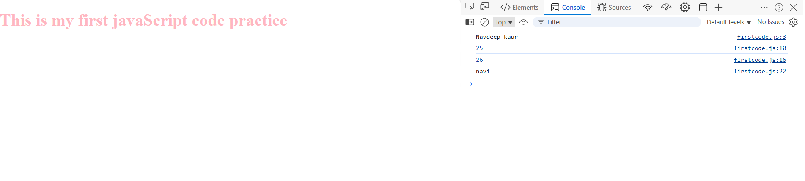
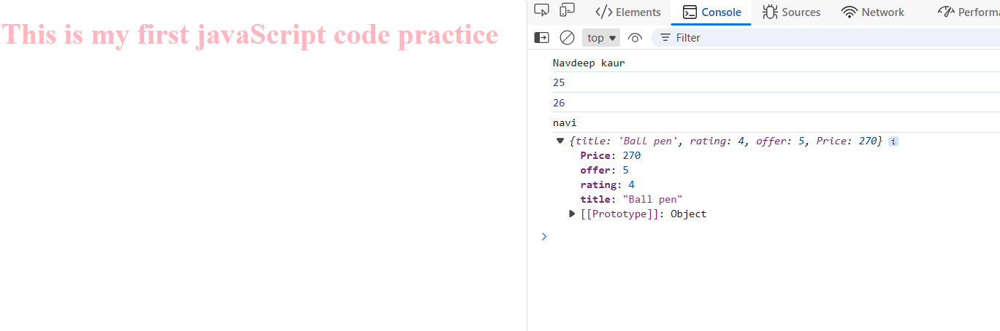
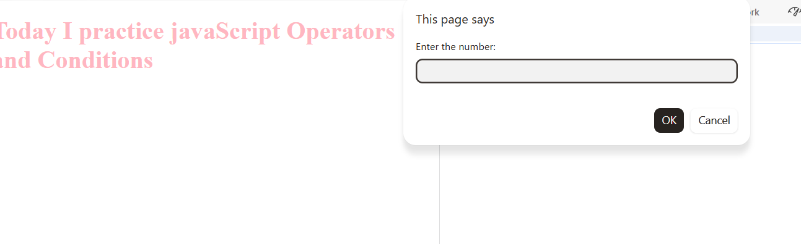
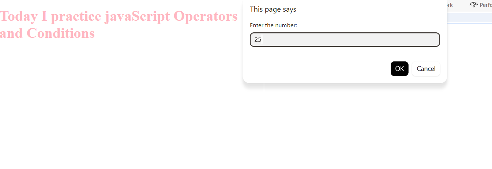
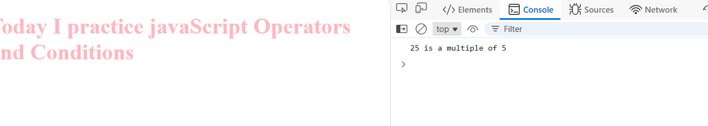
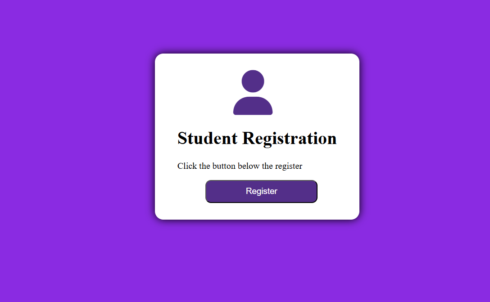
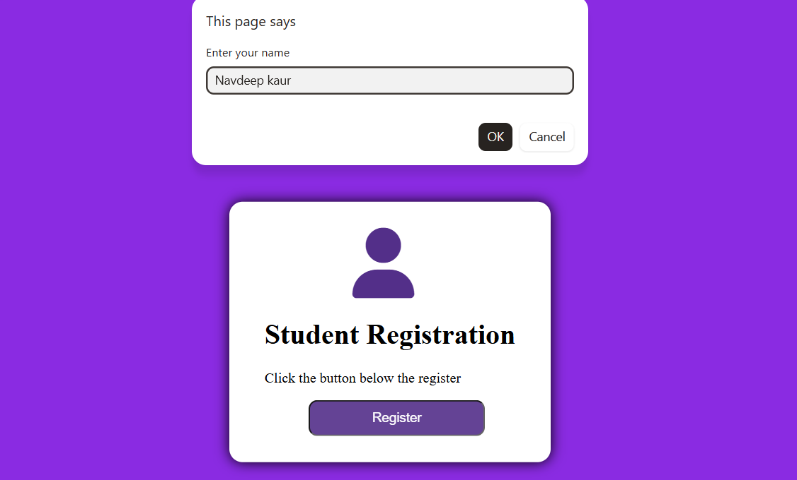
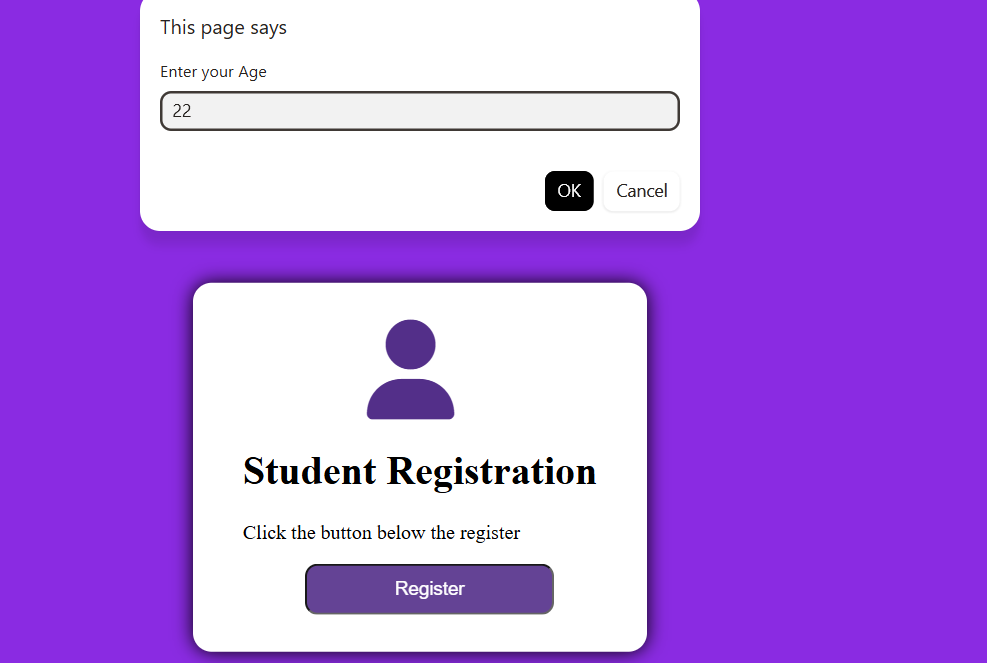
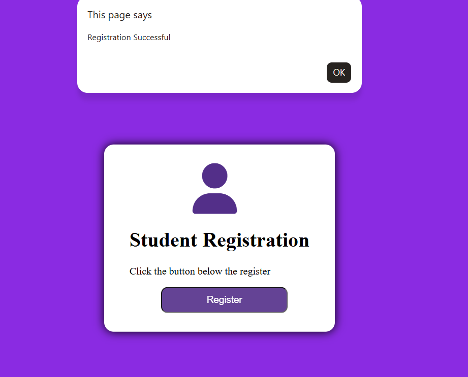

# Web DevelopmentProjects
This repository contains my frontend projects built using HTML , CSS , and JavaScript.

## Contact Form 
A simple contact form with basic validation using JavaScript.

## Portfolio Website 
### Home Page

### Projects Section

## Flex Design

## Grid Practice

## Mobile App Grid

### Profile Card
## profile card without js

## profile card with js alert msg

## Responsive Food UI 
### Responsive Food UI Home Page

### Responsive Food UI2

## Music landing page
### music landing page home page

### music landing page2

## Food delivery UI
### food delivery UI home page

### food delivery UI home page

## Netflix Clone UI
## Netflix clone UI Home page

## Netflix clone UI 2

## Coffee-shop-landing-page
### coffee-shop-landing-page1

### coffee-shop-landing-page2

### coffee-shop-landing-page3

## practice javaScript
### first code of javaScript

### practice javaScript

## practice javaScript operators and conditions
### operators and conditional and prompt use

### operators and conditional and prompt use page2

### operators and conditional and prompt use page3

## student register card
### student register card home page

### student register card 2

### student register card 3

### student register card 4

